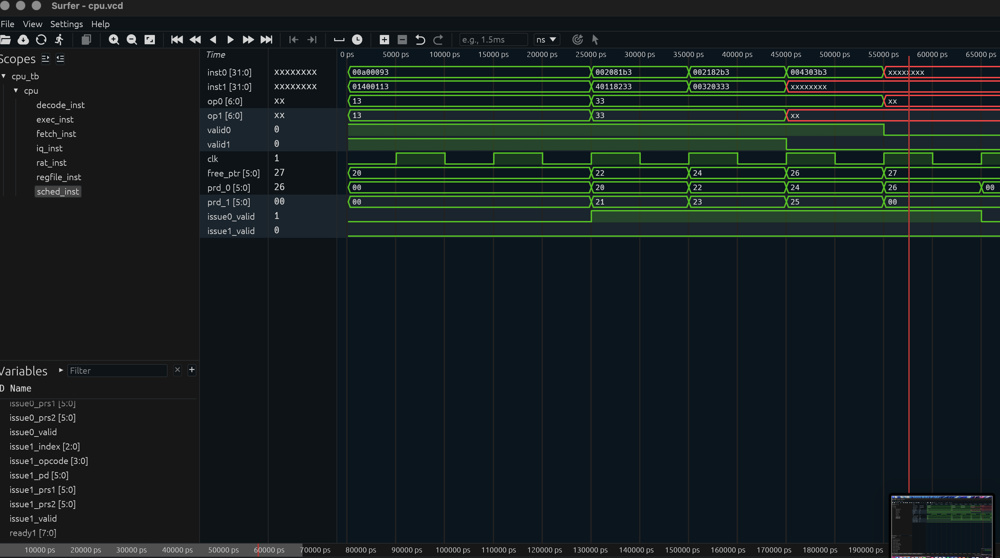

# RISC-V Out-of-Order Superscalar Core (Partial Implementation)

A Verilog implementation of a dual-issue, out-of-order execution pipeline based on the RISC-V architecture. 

This project currently demonstrates a fully functional front-end superscalar dispatcher with dynamic Register Alias Table (RAT) allocation and hazard detection. The back-end (Common Data Bus broadcast, Reorder Buffer commit) is still under active development.

## Architecture Highlights

* Dual-Issue Fetch and Decode: Fetches and decodes two 32-bit instructions per clock cycle.
* Dynamic Register Renaming (RAT): Maps 32 architectural registers to 64 physical registers. Handles simultaneous dual-allocation to prevent structural hazards and implements combinatorial intra-group bypassing.
* Superscalar Dispatcher: Detects Read-After-Write (RAW) hazards and dynamically stalls dependent instructions in the issue queue while allowing independent instructions to proceed simultaneously.

## Current Status

* [x] Dual Instruction Fetch
* [x] Instruction Decode
* [x] Register Renaming (RAT) and Free List Management
* [x] Issue Queue Dispatch and RAW Hazard Scoreboarding
* [ ] Execution Units (ALU) and Common Data Bus (CDB) Wakeup
* [ ] Reorder Buffer (ROB) and Precise In-Order Commit

## Getting Started

### Prerequisites
* Icarus Verilog (iverilog) with SystemVerilog support (-g2012).
* Surfer or GTKWave for waveform viewing.

### Running the Simulation
1. Clone the repository.
2. Compile the RTL and testbench:
   iverilog -g2012 -o sim/cpu_sim rtl/*.v tb/cpu_tb.v
3. Execute the simulation binary to generate the .vcd trace:
   vvp sim/cpu_sim
4. Open the waveform in Surfer:
   surfer waveforms/cpu.vcd

### Verification
In the waveform viewer, observe rat_inst.free_ptr and sched_inst.issue1_valid. You will see the physical register pointer successfully increment by 2 in a single clock cycle, resolving the resource starvation and allowing simultaneous dual-dispatch of independent instructions.

### Proof of Dual-Issue Dispatch

